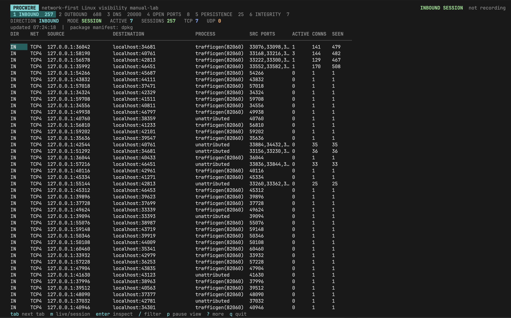

# ProcWire

**Network-first Linux visibility, from wire to process.**

ProcWire is a defensive Linux observability TUI written in Go. It starts with live and retained network activity, correlates sockets and DNS requests with processes and systemd services, inventories persistence mechanisms, and records the session as JSONL in the directory where it was launched.

ProcWire is under active development. Network socket state currently comes from procfs, while the DNS tab uses native eBPF programs attached to cgroup ingress and egress paths.



## Current Capabilities

- Native Charm interface built with Bubble Tea, Bubbles, and Lip Gloss.
- Separate top-level Inbound and Outbound views for TCP and UDP over IPv4 and IPv6.
- Live socket rows plus a retained Session view grouped by destination, direction, and process, with connection counts and source-port history.
- TCP inbound/outbound inference based on observed listening sockets.
- Socket-to-process attribution using `/proc/<pid>/fd` inode links.
- PID, process name, executable, command line, user, and systemd cgroup attribution.
- System-wide plaintext DNS query and response capture through pure-Go eBPF with process attribution.
- eBPF instructions assembled and loaded in-process, with no Clang, libbpf, libpcap, or sidecar binary required.
- A DNS tab with an alphabetically stable Current cache and a retained event-by-event History, plus TTL-aware observed answers, `/etc/hosts` entries, and DNS-derived network destination names.
- Dedicated open-port view for TCP listeners and unconnected UDP bound sockets.
- Inventory of system and user systemd services, timers, sockets, paths, mounts, automounts, swaps, drop-ins, masks, and shadowed definitions.
- Coverage of systemd control, attached, transient, generator, vendor, administrator, XDG, and discovered per-user unit directories.
- Inventory of system crontabs, user crontabs, anacron entries, and periodic cron directories.
- Native package-manifest verification for dpkg, pacman, and apk without invoking package-manager commands.
- Dedicated Integrity tab that provides a native `debsums -s`-style view of modified, local, generated, digest-less, and unverifiable persistence files.
- Automatic private JSONL recording with flow lifecycle, DNS, collector status, and persistence events.
- Single statically linked Linux ELF release builds with no shared-library or helper-command requirement.

## Provenance Labels

ProcWire colors persistence entries by evidence source:

| Label | Meaning |
| --- | --- |
| `package-match` | The inspected file digest matches the installed local package manifest. |
| `package-modified` | A package-owned file digest differs, or a local/modified drop-in changes an otherwise matching unit. |
| `package-owned` | A package owns the path, but its local metadata has no digest for that file. |
| `local` | A supported package database does not claim the path. |
| `generated` | The entry exists in a runtime or systemd generator directory. |
| `unverified` | No supported manifest exists or the path could not be verified. |

These labels deliberately do not say “malware” or “official.” A package match proves only that a file matches the local package database. A privileged attacker could modify both the file and that database. Stronger assurance requires trusted boot, IMA, remote attestation, or comparison against independently obtained signed packages.

The Integrity tab is broader than the real `debsums -s`: it also includes unowned local files, generated entries, and files that cannot be checked safely. ProcWire implements this natively so `debsums` does not need to be installed.

## Quick Start

Download the `v0.1.1` binary for your Linux architecture:

### AMD64 / x86_64

```sh
curl -fL https://github.com/xhzeem/procwire/releases/download/v0.1.1/procwire-linux-amd64 -o procwire
chmod +x procwire
sudo ./procwire
```

### ARM64 / AArch64

```sh
curl -fL https://github.com/xhzeem/procwire/releases/download/v0.1.1/procwire-linux-arm64 -o procwire
chmod +x procwire
sudo ./procwire
```

Root access activates system-wide DNS eBPF capture and provides broader process attribution. ProcWire can run without root, but the DNS tab will be marked degraded when the required BPF and cgroup permissions are unavailable.

## Run

ProcWire targets Linux. Run it as root, or with equivalent BPF and cgroup capabilities, to activate system-wide DNS capture. Without those privileges, the same app remains usable and marks only the DNS tab as degraded; procfs network visibility depends on ordinary `/proc` permissions.

```sh
./procwire
```

Useful options:

```text
--interval 1s       procfs polling interval
--output PATH       create a new JSONL report at PATH
--no-report         disable recording
--duration 30s      exit automatically after a fixed duration
--version           print build information
```

By default, ProcWire creates a file such as `procwire-20260816-120000.jsonl` in the launch directory. Reports use mode `0600` and are never silently overwritten. They can contain sensitive endpoints, executable paths, and command lines.

## Keys

| Key | Action |
| --- | --- |
| `1`, `2`, `3`, `4`, `5`, `6` | Open Inbound, Outbound, DNS, Open Ports, Persistence, or Integrity. |
| `tab`, `shift+tab` | Move between tabs. |
| `j`, `k`, arrows | Move through rows. |
| `enter` | Open evidence and attribution details. |
| `/` | Filter the current view. |
| `m` | Toggle Inbound/Outbound Live/Session or DNS Current/History. |
| `c` | Clear the network, DNS, or port filter. |
| `p` | Freeze or resume visible live-data rows. Collection and recording continue while paused. |
| `r` | Rescan persistence entries. |
| `?` | Expand or collapse help. |
| `q`, `ctrl+c` | Exit. |

## Build

Go 1.24.2 or newer is required.

```sh
make test
make vet
make build-linux-amd64 VERSION=dev
make build-linux-arm64 VERSION=dev
```

Release builds use `CGO_ENABLED=0`, `netgo`, and `osusergo`. The output is written under `dist/`.

## Ubuntu Integration Test

The integration test uses an already-cached `ubuntu:22.04` image and does not pull packages or install tools. It builds static ProcWire and traffic-generator binaries, starts real TCP, UDP, and DNS traffic in a privileged test container, runs the same ProcWire TUI release artifact, then validates its JSONL report.

```sh
make integration-ubuntu
```

The generator publishes a JSON fixture manifest instead of sharing hardcoded ports or persistence names with the verifier. Each run allocates new ephemeral ports and randomized unit names, then the validator requires all of the following:

- Four generated TCP listeners and three generated UDP listeners.
- Persistent and continuously churned inbound/outbound TCP connections with changing source ports.
- Short-lived random TCP listeners and UDP datagrams between polling intervals.
- A persistent DNS-targeted socket plus rotating queries over additional ephemeral sockets.
- Process attribution for generated listeners, sockets, DNS queries, and responses.
- Successful loading of the DNS eBPF programs and decoded responses for every manifest-listed name.
- Flow-close events after the generator exits, with repeated observations proving polling stability.
- Detection of two randomized local services, two linked timers, and two cron mechanisms.
- Detection of a modified package-owned systemd file identified through its canonical path in the manifest.
- A clean `session_end` record and a static ELF with no dynamic interpreter.

## Current Limits

- Procfs polling can miss short-lived connections between snapshots.
- Only the current network namespace is inspected; separate container namespaces are not traversed yet.
- DNS visibility covers plaintext UDP/TCP port 53. DoH and DoT are encrypted, and TCP messages split across packets are not reassembled yet.
- Kernels that reject `bpf_get_current_pid_tgid` for cgroup-skb programs fall back to DNS capture without PID/process attribution.
- The DNS Current view is an observed TTL cache plus `/etc/hosts`, not a dump of every resolver daemon's pre-existing cache. History begins when ProcWire starts.
- DNS packet parsing currently handles normal IPv4 and IPv6 headers, but not IPv4 fragments or IPv6 extension-header chains.
- Traffic byte and packet rates are not available from the current procfs collector.
- Session connection and observation counts represent socket lifecycles and polling observations, not packet counts.
- TCP direction is inferred from matching listeners. UDP is labeled `bound` only when it is unconnected; connected UDP remains `unknown` and is retained in the Outbound view with an explicit unclassified metric.
- `linked` systemd enablement means an applicable wants/requires/upholds link was observed. It does not claim that a unit is currently active.
- Cron eligibility is a conservative file-mode, filename, newline, and executable-bit check. Different cron/run-parts implementations can apply additional distribution-specific rules.
- Native package verification currently supports dpkg, pacman, and apk manifests. RPM databases are reported as unverifiable rather than invoking `rpm`.
- ProcWire cannot guarantee integrity after a complete root compromise.

## Roadmap

1. Add a pure-Go eBPF event collector for connect, accept, bind, close, send, and receive events.
2. Reassemble segmented TCP DNS and account for IP extension and fragmentation paths.
3. Collect traffic byte and packet counters without duplicate rows.
4. Traverse Linux network namespaces and identify container ownership.
5. Add native RPM provenance verification and optional trusted offline package comparison.
6. Correlate persistence entries, executables, network flows, DNS, and report history into an investigation timeline.
